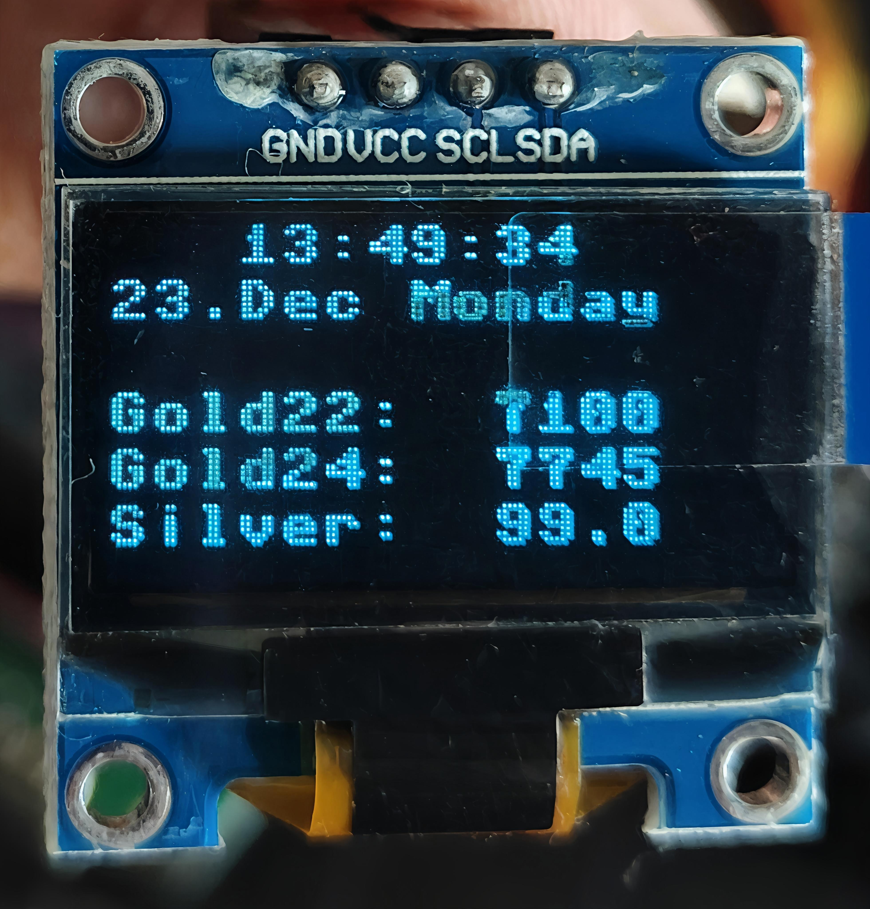

# MicroPython - Raspberry Pi Pico RP 2350

## Gold and Silver Rates Display
OLED display module (SSD1306 micro-controller) for the size of 0.96" and 128x64 pixel black background and Blue foreground colour display.

- Current Time (24 hours format) - refresh for every second
- Current Day and Date with Month information - refresh for every day
- Gold and Silver rates from REST API - refresh every day specific intervals
  - GET https://api.saganavis.xyz/v1/rates/goldRates
  - API returns JSON format

````
{
  "date": "2024-12-22",
  "gold22": 7100,
  "gold24": 7745,
  "silver": 99,
  "lastUpdated": "2024-12-23 09:00:15",
  "currentDateTime": "2024-12-23 14:48:02"
}
````



## Communication Protocols
I2C (Inter-Integrated Circuit) communication protocols used in embedded systems and IoT devices.
I2C uses two wires, SDA and SCL, for data transmission and synchronization.

### I2C
Use I2C when you want to control multiple peripherals with intermittent data transfers, or when speed isn't a major concern. I2C is also a good choice when you want to focus on simplicity and power consumption.
### SPI
Use SPI when you want to transfer a large amount of data at a high speed, or when you want to use a small number of peripherals. SPI is ideal for applications that require rapid data exchange.

## Required Libs
Use [thonny](https://thonny.org/) to install required libs from Tools - Manage Packages.

- logging
- ntptime
- ssd1306
- time
- threading (optional)
- functools (optional)


## What is main.py
Starting program should be in the name of "main.py". There are 2 main programs:

- lcd_main.py (based on hardware 20x4 LCD display)
- main.py (based on hardware 0.96" 128x64 OLED display)

## Raspberry Pi Pico 2350 Pinout Diagram

- Use the GP0 and GP1 as SDA and SCL respectively 
- For power source use the below GPIO pins
  - Use the VBUS as a power spirce (5V) for 20x4 LCD display.
  - For OLED 0.96" display use the 3V3 (OUT) GPIO pin to power up the display.
- For ground use the GND (black colour) GPIO pin.


